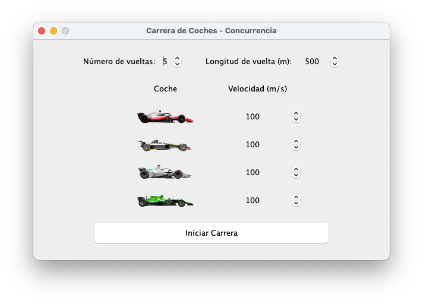
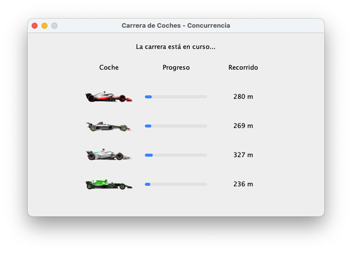
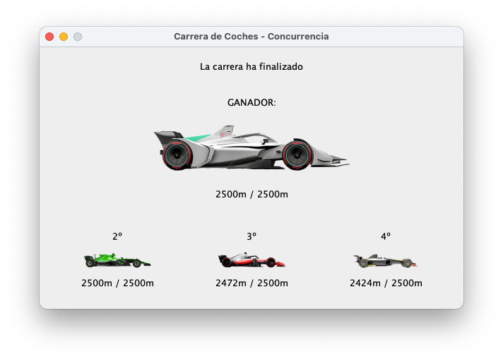

# Minijuego de azar simulador de una carrera de coches 🚗🏁

Este es un proyecto divertido que simula una carrera de autos utilizando Java Swing para la interfaz gráfica de usuario (GUI) y programación concurrente para gestionar la carrera en tiempo real. Cada coche tiene una velocidad configurada por el usuario, pero con un toque de aleatoriedad, lo que hace que la carrera sea impredecible y emocionante.

---

## Características ✨

- Interfaz gráfica interactiva creada con Java Swing.
- Configuración personalizada de la carrera:
  - Número de vueltas.
  - Longitud de cada vuelta en metros.
  - Velocidad de cada auto.
- Progreso en tiempo real con barras de progreso para cada auto.
- Fluctuaciones aleatorias de velocidad para mayor emoción.
- Muestra los resultados finales de la carrera con las posiciones de todos los autos.
- Implementación con hilos concurrentes para un movimiento fluido e independiente de los autos.

---

## Cómo Funciona 🛠️

1. Configuración de la carrera:
   - Establece el número de vueltas y la longitud de cada vuelta en la parte superior de la interfaz.
   - Personaliza la velocidad de cada auto usando los selectores de valores.

2. Ejecución de la carrera:
   - Pulsa el botón "Iniciar Carrera" para comenzar la simulación.
   - Los autos avanzarán de forma aleatoria dentro de un rango basado en su velocidad configurada.

3. Anuncio del ganador:
   - Una vez terminada la carrera, se destacará el coche ganador.
   - Se mostrará un resumen con las posiciones de todos los autos.

---

## Instalación y Configuración ⚙️

1. Asegúrate de tener Java 17 (o una versión posterior) instalado en tu sistema.

2. Clone the repository:
   ```bash
   git clone https://github.com/your-username/car-race-simulation.git
   cd car-race-simulation
   ```
   
3. Compila y ejecuta el programa:
   javac -d bin src/main/java/**/*.java
  java -cp bin view.View

---

## Estructura del Proyecto 🗂️
```plaintext
src/
├── controller/
│   └── CarreraController.java   - Gestiona la lógica de la carrera y el manejo de los hilos.
├── model/
│   └── Carrera.java             - Representa la configuración y lógica de la carrera.
├── view/
│   └── View.java                - Interfaz gráfica principal con componentes Swing.
resources/
└── images/
    ├── coche0.png               - Imagen del coche 0.
    ├── coche1.png               - Imagen del coche 1.
    ├── coche2.png               - Imagen del coche 2.
    └── coche3.png               - Imagen del coche 3.
```
---

## Uso 🕹️

1. Abre el programa.
2. Configura:
   - Número de vueltas: selecciona entre 1 y 10.
   - Longitud de la vuelta: selecciona entre 100m y 1000m.
   - Velocidades de los coches: ajusta la velocidad individual (en metros por segundo).
3. Inicia la carrera y observa cómo avanzan las barras de progreso en tiempo real.
4. Consulta los resultados de la carrera, incluyendo el ganador y las posiciones de todos los autos.

---

## Personalización 🎨

Puedes mejorar el proyecto:
- Agregando más coches.
- Modificando el rango de fluctuación de las velocidades aleatorias.
- Cambiando las imágenes de los coches para personalizar la carrera.

---

## Capturas de Pantalla 📸





---

## Licencia 📜

Este proyecto está licenciado bajo la Licencia MIT. Siéntete libre de usarlo, modificarlo y compartirlo como desees.

---

## Contribuciones 🤝

¡Contribuciones, sugerencias y comentarios son bienvenidos! Siéntete libre de hacer un fork del repositorio y enviar pull requests.

---

## Contacto 📧

Si tienes preguntas o deseas conectar, no dudes en ponerte en contacto:
- [LinkedIn](https://www.linkedin.com/in/gdfizan/)
- [GitHub](https://github.com/g4vr3)
